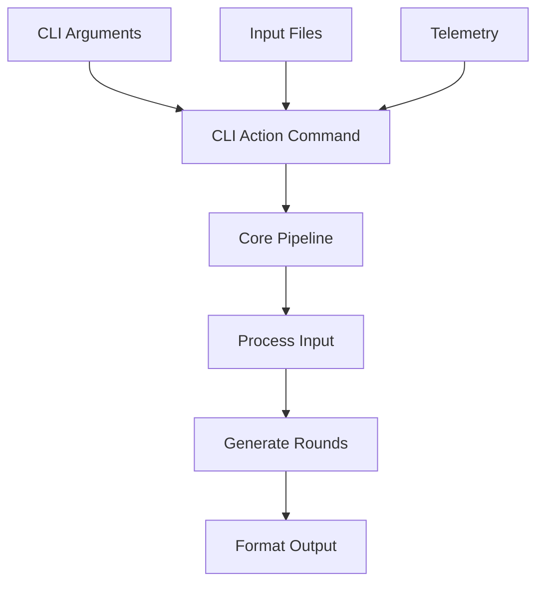

# Architecture

## Design Principles

The project follows functional programming principles with a strong emphasis on:

- Immutable data using readonly types and functional utilities
- Pure functions with explicit dependencies
- Error handling via discriminated union Result type
- Side effects isolated to system boundaries
- Command pattern for orchestrating complex operations
- Type-driven development with strong TypeScript types

## Core Layers

### Command Layer (`commands/`)

Orchestrates the main execution pipeline:

1. CLI Action Command - Entry point, handles telemetry and notices
1. Core Pipeline Command - Coordinates processing and generation
1. Process Input Command - Input validation and normalization
1. Generate Rounds Command - Tournament pairing generation

### Validation Layer (`validators/`)

Multi-stage validation pipeline:

- CLI option validation (types, ranges)
- File format validation (CSV/JSON)
- Tournament rule validation (team counts, constraints)
- Generated round validation (completeness, uniqueness)

### Tournament Logic (`swiss-pairing/`)

Pure functional implementation of Swiss pairing algorithm:

- Match history tracking via bidirectional maps
- Squad constraint enforcement
- Round validation
- Backtracking for optimal pairings

### Data Flow



### Error Handling

Uses discriminated union Result type:

```typescript
type Result<T> =
  | { readonly success: true; readonly value: T }
  | { readonly success: false; readonly message: string };
```

Key aspects:

- No exceptions for expected errors
- Early validation in pipeline
- Clear error contexts and origins
- Type safety for success/failure paths

### Testing Strategy

- Unit tests for pure functions
- Integration tests with fixtures
- Performance tests for scaling
- Mock-based testing for side effects

### Privacy & Telemetry

Built-in privacy controls:

- No PII collection
- Opt-out support
- First-run notice
- Environment-based rules
- Clear data boundaries

## Key Patterns

### Command Pattern

Commands encapsulate:

- Input validation
- Core business logic
- Error handling
- Telemetry integration
- Resource cleanup

### Builder Pattern

Tournament generation uses progressive refinement:

1. Raw input validation
1. Option normalization
1. Team preparation
1. Round generation
1. Output formatting

### Factory Pattern

Used for creating specialized objects:

- Team/Squad builders
- Match generators
- Output formatters
- Telemetry recorders

### Repository Pattern

File handling abstraction:

- Unified interface for CSV/JSON
- Consistent error handling
- Validation pipeline integration
- Format-specific parsing

## Project Dependencies

The project's internal module dependencies are visualized in [Dependencies Overview](dependencies-overview.html); and file dependencies in [Dependencies Detailed](dependencies-detailed.html)
This visualization is automatically generated and updated on git push using `dependency-cruiser`.

Key dependency rules enforced:

- No circular dependencies
- Utils cannot depend on domain modules
- Test files cannot be imported into source
- Domain modules (swiss-pairing, validators, parsers, formatters) depend only on types and utils

All dependencies are managed via npm. See [package.json](../package.json) for the complete list of runtime and development dependencies.

## Technology Stack

### Core

- TypeScript 5.6
- ESM modules
- Pure functions
- Immutable data

### Testing

- Jest
- Integration fixtures
- Performance benchmarks
- Coverage tracking

### Quality

- ESLint
- Prettier
- Strict TypeScript
- Husky hooks
- Dependency Cruiser

### Development

- VS Code
- Node.js 20
- npm
- Debug logging
